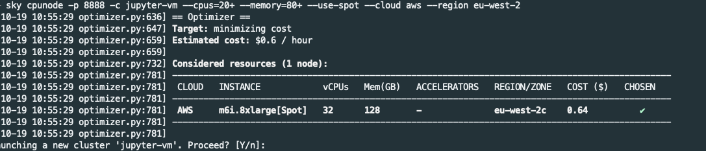
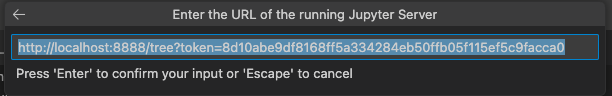

# [Using Skypilot for Jupyter Notebooks](https://docs.google.com/presentation/d/1rJPmh7WDakxl3RdXzOxQhl-ysn6myZb1JoxvWJFwkIM/edit?usp=sharing)

## Setup

1. Make a new conda/ virtual environment
    `conda create -n sky_env python=3.9 -y`

2. Activate the environement and install skypilot

    `conda activate sky_env`

    `pip install skypilot`

## Drive your cloud instance

1. Start the node instance, and forward port 8888 (replace ***your_name-vm*** with desired ***cluster name***)

    `sky cpunode -p 8888 -c your_name-vm --cpus=20+ --memory=80+ --use-spot --cloud aws --region eu-west-2`

    This starts a cloud cpu node instance `your_name-vm`, forwards port 8888 of the cloud instance to your localhost port 8888

2. Review and confirm the chosen instance, resources, pricing, region/ zone

    

    Skypilot will provision the chosen resources, and you will be ssh'd into the cloud instance

3. Install dependencies (you can install others)

    `pip install notebook git+https://github.com/nestauk/nesta_ds_utils.git#egg=nesta_ds_utils"[all]"`

4. Start jupyter notebook server

    `jupyter notebook`

5. Copy and paste the url/ token to your browser or vscode kernel address:

    

## **REMINDER: TURN OFF UNUSED RESOURCES**

Run the following (replace ***your_name-vm*** with desired ***cluster name***):

### End your ssh session and return to your local terminal: `exit`

### Tear down your cluster: `sky down your_name-vm`
