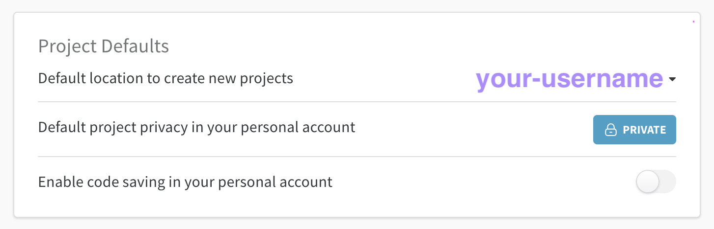
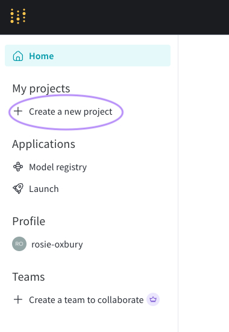
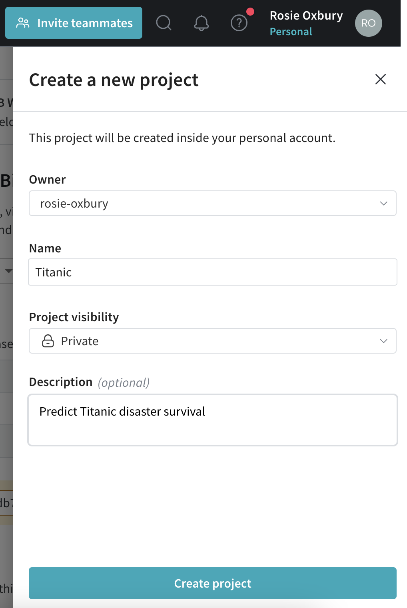
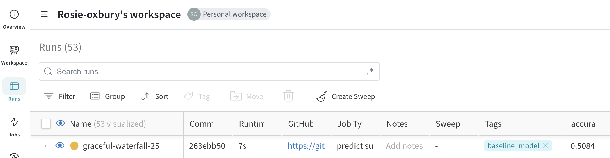
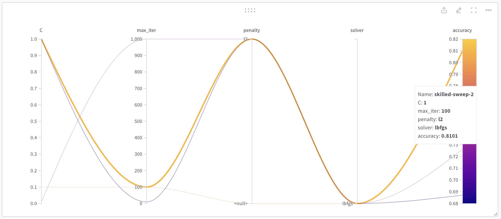

# Weights and biases

## Setup

### Wandb set up

#### Sign up to weights and biases and create a new project

From [this page](https://wandb.ai/site), click "Sign up" and follow instructions there. **Sign up with your Nesta email.**

In your *User settings*: **change the default location of new projects to your personal account.** This is so that the Nesta org space doesn't get clogged up with all the projects we're going to create in this tutorial :)



#### Create a new project

Create a new project, and let's call it Titanic because that's the data we'll be using.





### Clone this repo

You've probably done this already if you've attended a have-a-go before :)

### Environment
Create a conda environment:
```
conda create -n wandb_demo python=3.10   
```

Activate the environment:
```
conda activate wandb_demo
```

Install pip:
```
conda install pip
```
Install requirements:
```
pip install -r wandb/requirements.txt
```

Create an ipykernel for your conda environment:
```
python -m ipykernel install --user --name=wandb_demo
```
### `.env`

Create a file `dap_tutorials/wandb/.env` with one variable:

```
wandb_username = "yourusernamehere"
```

Actually this is not super necessary but somehow seems nicer than writing your username in the code :) And the have-a-go code depends on it being set up this way!

### Download data
Download the `train.csv` Titanic data from Kaggle [here](https://www.kaggle.com/competitions/titanic/data) and store it in `wandb/inputs/`.

## How to use

The scripts in `wandb_demo/` show some example Weights and Biases workflows at different levels of complexity. In all of them, the scenario is that based on the available training data, we are trying to predict whether a passenger survived the Titanic disaster.

1. `baseline_classifier.py`: this script sets up a simple dummy classifier and logs a single run on weights and biases. It guesses whether a passenger survived based on the survival rate calculated from the training data. Depending on the random seed chosen, it should give accuracy of 50-60%. You can see this by navigating to your project on the weights and biases interface, finding the "Titanic" project, and looking under "Runs":



2. `logistic_regression.py`: this script sets up a logistic regression model and again, logs this as a run on weights and biases.

3. `sweep_log_reg.py`: now that we have progressed from a dummy classifier to an ML model, we might want to improve the performance of that model. This script uses a [sweep](https://docs.wandb.ai/guides/sweeps) to find optimal hyperparameter values for the logistic regression model. There are two important parameters at the top of the script that you can change to control the sweep:
    - `sweep_config`: the hyperparameters to sweep over as well as the method to use (random search, grid search, or Bayes).
    - `N_RUNS`: we are using Random Search, so once we specify how many runs we would like to execute, the sweep agent will try this many random combinations of hyperparameters from our sweep config.

Once your sweep is done, navigate to the "Sweeps" view of your "Titanic" project and click on the most recent sweep. You will be able to see how different parameter combinations led to different model performance. Wandb provides handy parallel coordinates interactive plots, where each run within a sweep is a single line, model performance is the yaxis at the right of the graph, and different parameter settings are columns within the graph:



4. `sweep_different_classifiers.py`: it's worth knowing that you are not restricted to trying out different hyperparameter values within one sweep - you could also try out different models. In this sweep, we compare Random Forest, SVM and Logistic Regression, and also vary some of the important hyperparameters of those models. You could extend this approach to try out, for example, different embeddings, different feature selection methods, etc. You can customise the sweep config and the `train()` function to account for anything you want to control or vary.
